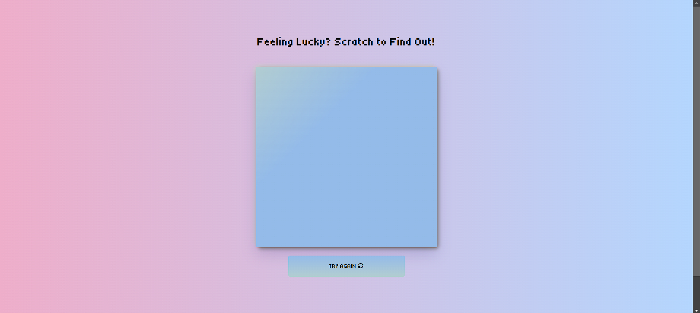
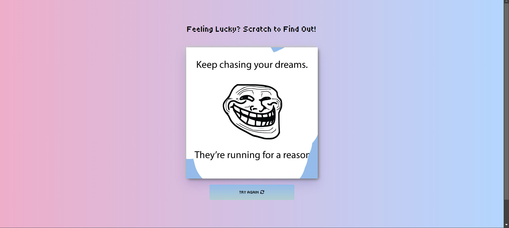
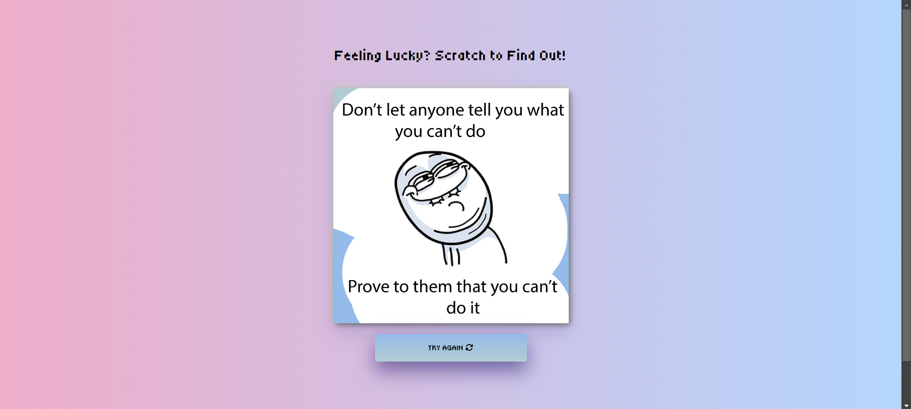

# Scratch & Lose 
> Demotivating quotes revealed with every scratch

## Basic Details

### Team Name: Zenith

### Team Members
- Team Lead: Adheethi - MESCE
- Member 2: Fathima Minha - MESCE
- Member 3: Minha Gafoor - MESCE

### Project Description
Scratch & Lose is a web-based project where users scratch a virtual card to reveal demotivating quotes, promoting laughter and irony.

### The Problem (that doesn't exist)
Lack of demotivation in people's lives.

### The Solution (that nobody asked for)
Provide humorous, demotivating quotes to users.

## Technical Details

### Technologies/Components Used
#### Software
- Languages: HTML, CSS, JavaScript
- Tools: Visual Studio Code

### Implementation
VS CODE

*Project Documentation*

*Screenshots*

_Caption: Initial scratch card view_

_Caption: Scratching reveals demotivating quote_

_Caption: Scratching reveals another demotivating quote_
<a href="https://adheethi03.github.io/Scratch_And_Lose/" target="_blank"> host link Scratch & Lose</a>

*Team Contributions*
- ADHEETHI
- Fathima Minha
- Minha Gafoor

